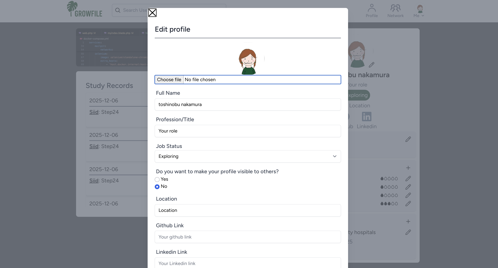
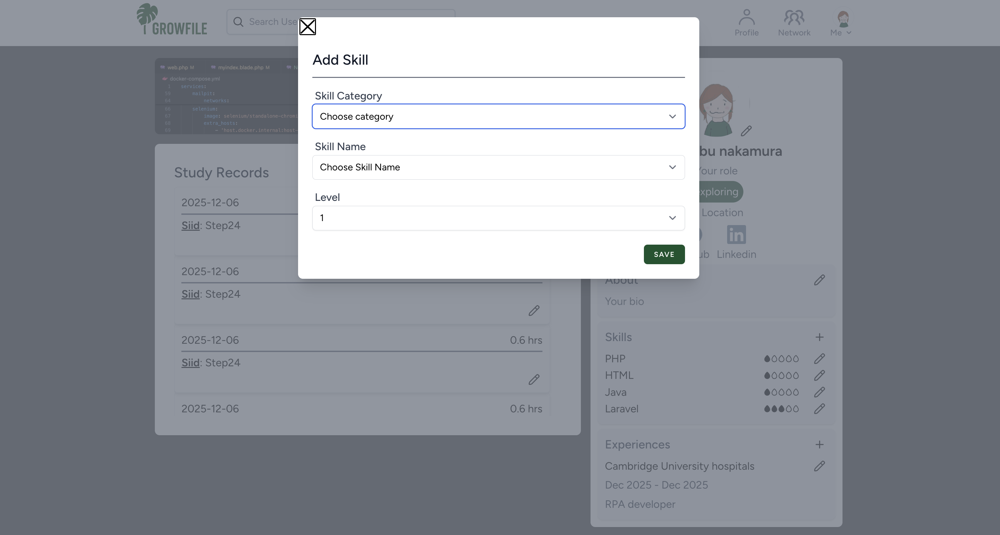
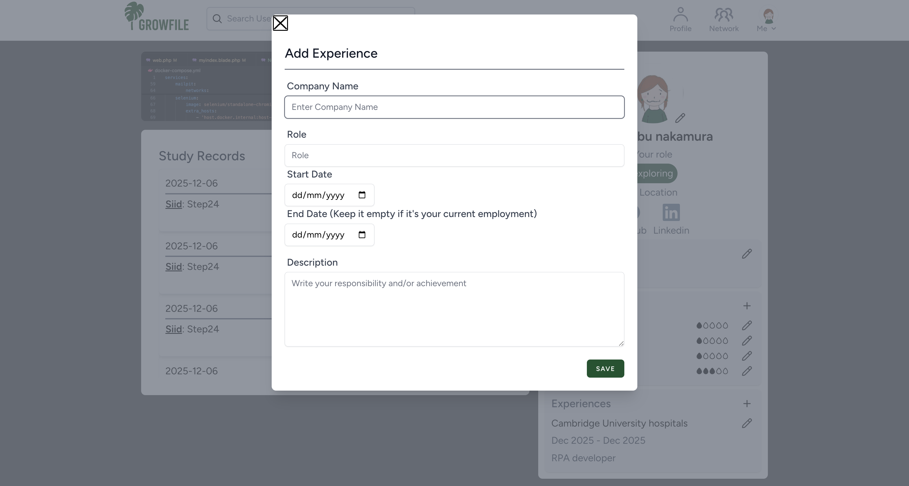

# GrowFile

GrowFileは、個人プロフィールと学習記録機能を掛け合わせたWebアプリケーションです。

プロフィールに加えて勉強時間や制作物等の自主学習関連情報を一元化することで、学習意欲や成果を他の人にも見えやすくして、職務を通じて培う保有スキルや経歴だけでなく、自主学習の過程や結果もアピールできる場を提供できればとの思いから開発しました。

アイディアは、私自身が未経験でのエンジニア転職を目指して勉強をしている中で、自身のスキル・経験が心許ない現状において、勉強の記録をどうにかしてアピール材料にできないかと考えたのがきっかけです。メインのユーザーは、自分と同じような境遇の未経験エンジニアの方を想定しています。
ロケーションや保有スキルによるユーザー検索機能・フォロー機能も搭載しており、同領域のエンジニアや興味・関心のある分野のエンジニアを簡単に見つけてフォローすることができます。

現状では、勉強時間の記録機能のみに留まっていますが、今後は読書記録・コース受講記録・ポートフォリオ・執筆記事も掲載できるように拡張していくつもりです。

※ 本アプリケーションは、スマートフォンおよびPCに対応したレスポンシブデザインを採用しています。

---

## スクリーンショット

### トップページ

### プロフィールページ

### 学習記録

### ユーザー検索

### 検索結果

### レスポンシブデザイン

---

## 主な機能

### ①　ユーザー検索・フィルター機能（名前・ロケーション・スキルを基に絞り込めます）

### ②　プロフィール作成機能（履歴書・職務経歴書と同様の内容を記載するだけでプロフィールを簡単に作成できます）

### ③　学習記録機能（日々の学習の記録ができます）

### ④　フォロー機能

---

## 使用技術

### バックエンド
- PHP
- Laravel 12
- Composer
- Livewire

### フロントエンド
- HTML5/CSS3
- Tailwind CSS
- JavaScript（ES6+）
- Vite
- AlpineJS

### データベース
- PostgreSQL

### 開発環境
- Docker
- Git/GitHub

---

## ER図
