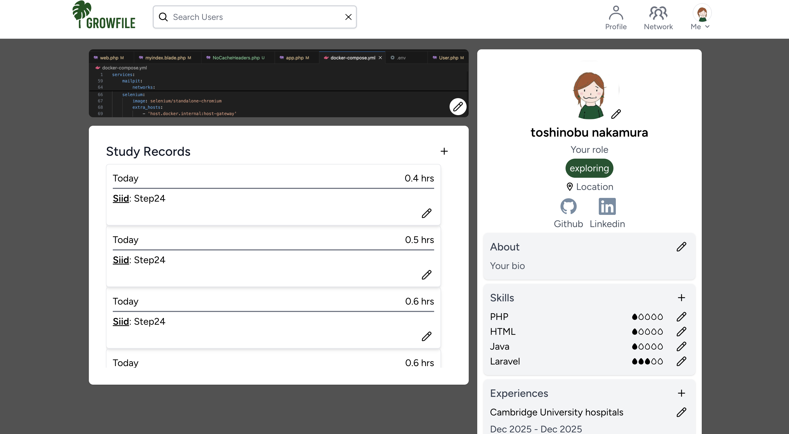
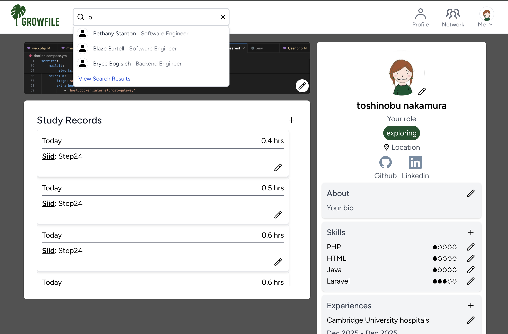
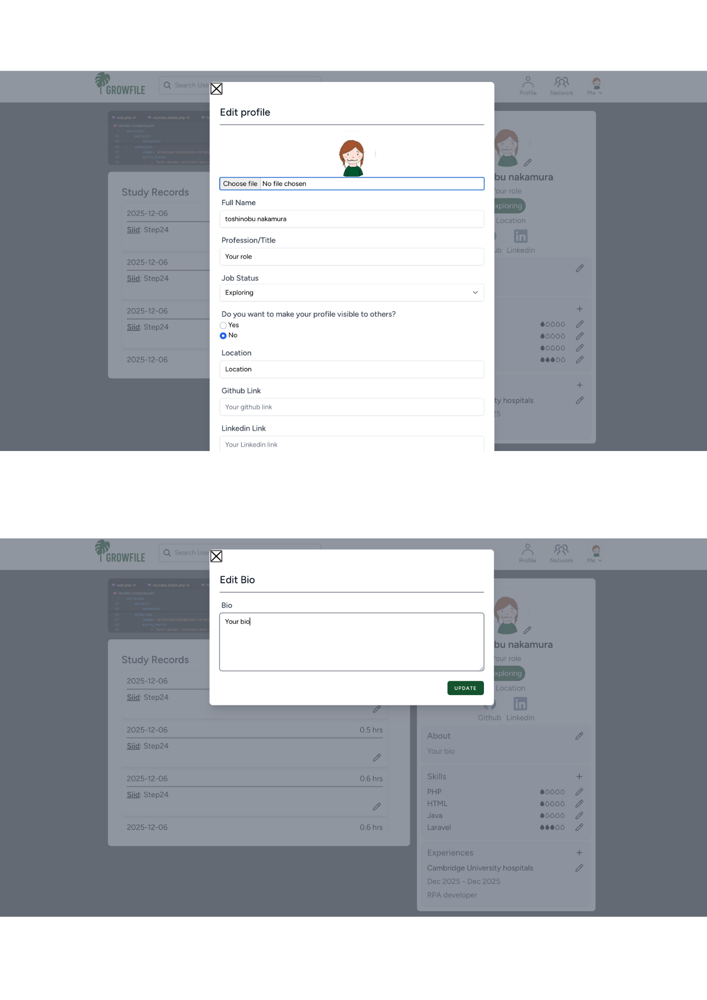

# GrowFile

GrowFileは、個人のプロフィールと学習記録を融合させたWebアプリケーションです。

知識やスキル向上のために日々勉強に励んでいるエンジニアの方たちが、プロフィールと共に学習時間等を公開することで、学習意欲や継続力をリクルーターや企業に対してアピールできる場を提供できればとの思いから開発しました。

アイディアは、私自身が未経験でのエンジニア転職を目指して勉強をしている中で、スキル・経験が心許ない現状において私の唯一の武器である学習意欲・継続力を証明できる場所が欲しいと思ったからです。
場所・保有スキルによるユーザー検索機能・フォロー機能も搭載しており、同領域のエンジニアや興味・関心のある分野のエンジニアを簡単に見つけてフォローすることができます。

※ 本アプリケーションは、スマートフォンおよびPCに対応したレスポンシブデザインを採用しています。

---

## スクリーンショット

### トップページ

### プロフィールページ

### 学習記録

### ユーザー検索

### 検索結果

### レスポンシブデザイン

---

## 主な機能

### ①　ユーザー検索・フィルター機能（名前・ロケーション・スキルを基に絞り込めます）

### ②　プロフィール作成機能（履歴書・職務経歴書と同様の内容を記載するだけでプロフィールを簡単に作成できます）

### ③　学習記録機能（日々の学習の記録ができます）

### ④　フォロー機能

---

## 使用技術

### バックエンド
- PHP
- Laravel 12
- Composer
- Livewire

### フロントエンド
- HTML5/CSS3
- Tailwind CSS
- JavaScript（ES6+）
- Vite
- Node.js/npm
- AlpineJS

### データベース
- PostgreSQL

### 開発環境
- Docker
- Git/GitHub

---

## ER図
